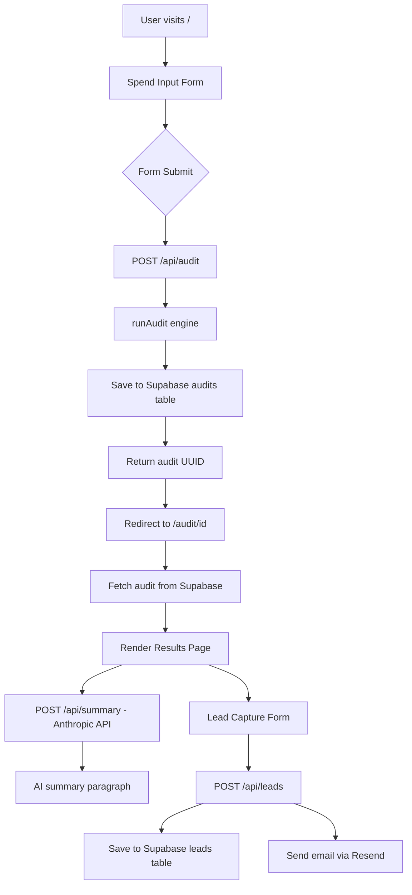

# ARCHITECTURE.md

## System Diagram

## Data flow

1. User fills form → selects tools, plans, spend, seats
2. On submit → POST /api/audit with form data
3. Server runs auditEngine.ts (pure TypeScript, no AI)
4. Result saved to Supabase audits table, UUID returned
5. Browser redirects to /audit/[uuid]
6. Page.tsx (server component) fetches audit from Supabase
7. AuditSummary.tsx (client component) fetches 
   /api/summary → calls Anthropic API → returns 
   100-word paragraph (with fallback if API fails)
8. User optionally submits email → /api/leads → 
   Supabase + Resend email

## Why I chose this stack

**Next.js 14 (App Router):** Server components for 
fast initial load and SEO on result pages. API routes 
for backend logic without a separate server.

**TypeScript:** Required for a finance-facing tool 
where type safety prevents incorrect savings calculations.

**Tailwind CSS:** Fastest way to build a polished UI 
without a design system. No custom CSS needed.

**Supabase:** Instant Postgres with RLS, no backend 
setup. Free tier handles thousands of audits.

**Resend:** Simplest transactional email API. 
3-line integration, reliable delivery.

**Vercel:** Zero-config deploy for Next.js. 
Automatic preview deployments on every push.

## What I'd change at 10,000 audits/day

1. **Add Redis caching** (Upstash) for audit results — 
   repeated views of the same audit ID hit cache, 
   not Supabase
2. **Move audit engine to Edge Runtime** for lower 
   latency — pure TypeScript with no Node dependencies
3. **Add a job queue** (Inngest or Trigger.dev) for 
   email sending — currently synchronous, would fail 
   silently under load
4. **Database indexes** on audits.created_at and 
   leads.audit_id for analytics queries
5. **Separate read replicas** for the public audit 
   view vs the write path